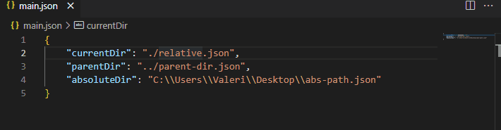

# Pathify

Open files from path string literals.

Just hover over the path and Alt + D. 

Hover over path, then Alt + D.
Hover over path, then Alt + D.
Hover over path, then Alt + D.
Hover over path, then Alt + D.
Hover over path, then Alt + D.
Hover over path, then Alt + D.

## Features

Describe specific features of your extension including screenshots of your extension in action. Image paths are relative to this README file.

For example if there is an image subfolder under your extension project workspace:

## Requirements

No requirements

## Extension Settings

No settings - works out-of-the-box!

## Release Notes

### 0.0.1

- Resolves absolute, relative and parent paths.

### 0.0.2

- Adds icon and description

### 0.0.3

- Adds keywords

---
